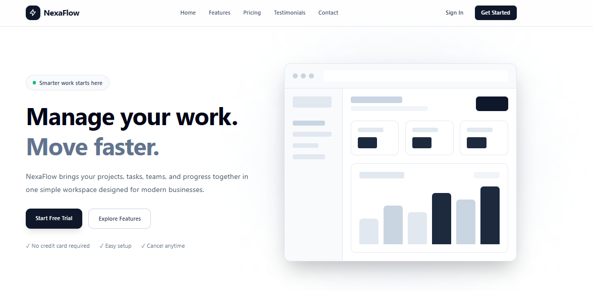

# NexaFlow - Responsive Product Landing Page

## Introduction

NexaFlow is a modern productivity and workflow platform designed to help teams manage their projects, tasks, schedules, and collaboration in one workspace.

This project was created for the Week 5 Laboratory Activity in ITST 302 - Client-Server Technologies.

The main purpose of this project is to create a responsive product landing page using Laravel, Tailwind CSS, and reusable Blade Components.

A product landing page is a web page designed to introduce a product or service to users. It provides important information about the product, its features, pricing, and benefits while encouraging visitors to take an action such as starting a free trial or contacting the company.

Landing pages are important for businesses because they provide customers with a clear first impression of a product or service. A well-designed landing page can also help improve user engagement and encourage visitors to become customers.

For this project, NexaFlow was designed with a clean and modern interface that works across desktop, tablet, and mobile devices.

---

# Objectives

The objectives of this project are:

- Develop a responsive web interface using Tailwind CSS.
- Create reusable Laravel Blade Components.
- Apply responsive design principles for desktop, laptop, tablet, and mobile devices.
- Use Flexbox and CSS Grid to organize the page layout.
- Apply consistent typography, spacing, colors, and layouts.
- Understand component-based frontend development.
- Organize frontend files using Laravel best practices.
- Create a professional portfolio project using Laravel.
- Practice using Git and GitHub for project management.

---

# Technologies Used

The project was developed using the following technologies:

- Laravel
- PHP
- Blade Templates
- Tailwind CSS
- Vite
- HTML
- JavaScript
- Git
- GitHub
- Visual Studio Code

---

# Main Features

The NexaFlow landing page contains the following sections:

## Navigation Bar

The navigation bar contains:

- NexaFlow logo
- Home
- Features
- Pricing
- Testimonials
- Contact
- Sign In
- Get Started

The navigation is responsive and changes into a mobile menu on smaller screens.

---

## Hero Section

The hero section introduces the NexaFlow product.

It contains:

- Product name
- Main headline
- Product description
- Start Free Trial button
- Explore Features button
- Product dashboard mockup
- Product benefits

The main message of the hero section is:

> Manage your work. Move faster.

---

## Features Section

The page contains six product features:

1. Task Management
2. Team Collaboration
3. Smart Scheduling
4. Project Dashboard
5. Fast Automation
6. Secure Workspace

Each feature is displayed using a reusable Blade Component.

---

## Product Showcase

The Product Showcase section provides a preview of the NexaFlow dashboard.

It includes:

- Dashboard preview
- Project statistics
- Project progress
- Task progress
- Real-time project information
- Mobile-friendly design
- Simple interface

The dashboard is designed as a frontend mockup using HTML and Tailwind CSS.

---

## Pricing Section

The pricing section contains three plans:

### Starter

Price:

**₱499/month**

Includes:

- Up to 5 team members
- 10 active projects
- Task management
- Basic dashboard
- Email support

### Professional

Price:

**₱999/month**

Includes:

- Up to 25 team members
- Unlimited projects
- Advanced dashboard
- Team collaboration
- Smart automation
- Priority support

### Enterprise

Price:

**Custom**

Includes:

- Unlimited team members
- Unlimited projects
- Advanced security
- Custom integrations
- Dedicated support
- Custom reporting

The Professional plan is highlighted as the most popular plan.

---

## Testimonials

The landing page contains three customer testimonials.

The testimonials represent different types of users:

- Project Manager
- Startup Founder
- Marketing Lead

Each testimonial contains:

- Customer name
- Position
- Customer initials
- Review
- Five-star rating

---

## Call-to-Action Section

The Call-to-Action section encourages users to start using NexaFlow.

It contains:

- Start Free Trial button
- Contact Sales button

The purpose of this section is to encourage visitors to take action after viewing the product information.

---

## Footer

The footer contains:

- Company information
- Product links
- Company links
- Contact information
- Social media icons
- Copyright information

---

# Responsive Web Design

Responsive web design allows a website to adjust its layout depending on the screen size of the device.

This project was designed to support:

- Desktop
- Laptop
- Tablet
- Mobile Phone

Responsive design is important because users access websites using different devices and screen sizes.

A website should remain readable, usable, and visually organized regardless of the device being used.

---

## Mobile-First Design

The project uses responsive Tailwind CSS utility classes to make the interface work on smaller screens.

On mobile devices:

- Navigation links are hidden.
- A hamburger menu is displayed.
- Hero content is stacked vertically.
- Buttons become easier to use on smaller screens.
- Dashboard content adjusts to the available width.
- Feature cards are displayed in a single-column layout.

The layout expands as the screen becomes larger.

---

## Responsive Breakpoints

Tailwind CSS responsive utility classes were used to change the layout at different screen sizes.

Examples include:

```text
sm:
md:
lg:
```

For example:

```html
<div class="grid gap-6 sm:grid-cols-2 lg:grid-cols-3">
```

This allows the feature cards to display as:

- One column on small screens
- Two columns on medium screens
- Three columns on large screens

---

## Flexbox

Flexbox was used for layouts where elements need to be aligned horizontally or vertically.

Example:

```html
<div class="flex items-center justify-between">
```

Flexbox was used in:

- Navigation
- Buttons
- Feature information
- Testimonial information
- Footer sections

---

## CSS Grid

CSS Grid was used for larger page layouts.

Example:

```html
<div class="grid gap-6 sm:grid-cols-2 lg:grid-cols-3">
```

Grid was used for:

- Feature cards
- Pricing cards
- Testimonials
- Hero section
- Product showcase
- Footer

---

## User Experience

The interface was designed to provide a simple and clear user experience.

The design uses:

- Clear headings
- Consistent spacing
- Easy-to-understand navigation
- Visible call-to-action buttons
- Simple cards
- Responsive layouts
- Consistent typography

These choices make it easier for users to understand the product and navigate through the page.

---

# Tailwind CSS

Tailwind CSS is a utility-first CSS framework that allows developers to style HTML elements using predefined utility classes.

Instead of creating a large number of custom CSS classes, Tailwind allows styles to be applied directly to HTML elements.

Example:

```html
<button class="rounded-xl bg-slate-900 px-6 py-3.5 text-sm font-semibold text-white hover:bg-slate-700">
    Start Free Trial
</button>
```

This example uses Tailwind utility classes for:

- Rounded corners
- Background color
- Padding
- Font size
- Font weight
- Text color
- Hover effects

---

## Advantages of Tailwind CSS

Tailwind CSS was useful for this project because:

- It allows fast UI development.
- It provides responsive utility classes.
- It makes spacing consistent.
- It makes hover effects easy to implement.
- It reduces the need for large custom CSS files.
- It allows responsive layouts to be created directly in the HTML.

---

## Responsive Utility Classes

Examples used in the project include:

```text
sm:grid-cols-2
lg:grid-cols-3
md:flex
md:hidden
```

These classes allow the interface to change depending on screen size.

For example:

```html
<div class="hidden items-center gap-8 md:flex">
```

The navigation is hidden on small screens and displayed as a flex layout on medium and larger screens.

---

## Component Styling

Tailwind CSS is also used inside the reusable Blade Components.

For example, the feature card uses:

```html
<div class="group rounded-2xl border border-slate-200 bg-white p-6 transition duration-300 hover:-translate-y-1 hover:shadow-xl">
```

This creates:

- Rounded corners
- Border
- White background
- Padding
- Smooth transition
- Hover movement
- Shadow effect

---

# Blade Components

Blade Components are reusable pieces of Laravel's Blade template system.

Instead of repeating the same HTML code multiple times, a component can be created once and reused throughout the page.

This makes the project easier to organize and maintain.

---

## Components Used

The project contains the following reusable Blade Components:

```text
resources/views/components/

navbar.blade.php
hero.blade.php
feature-card.blade.php
pricing-card.blade.php
testimonial-card.blade.php
button.blade.php
footer.blade.php
```

---

## Navbar Component

File:

```text
resources/views/components/navbar.blade.php
```

The navbar component contains the website navigation and mobile navigation menu.

It can be reused on different pages without copying the entire navigation HTML.

---

## Hero Component

File:

```text
resources/views/components/hero.blade.php
```

The hero component contains the main introduction to NexaFlow.

It includes the product headline, description, buttons, and dashboard mockup.

---

## Feature Card Component

File:

```text
resources/views/components/feature-card.blade.php
```

The feature card accepts different values such as:

```blade
<x-feature-card
    icon="✓"
    title="Task Management"
    description="Create, assign, organize, and track tasks from one simple workspace."
/>
```

The same component can therefore be reused for all six features.

---

## Pricing Card Component

File:

```text
resources/views/components/pricing-card.blade.php
```

The pricing card is reused for the Starter, Professional, and Enterprise plans.

Example:

```blade
<x-pricing-card
    name="Starter"
    price="₱499"
    description="For individuals and small projects."
>
```

This reduces duplicated HTML code.

---

## Testimonial Card Component

File:

```text
resources/views/components/testimonial-card.blade.php
```

The testimonial component is reused for all three customer reviews.

It accepts:

- Customer name
- Position
- Initials
- Review

---

## Button Component

File:

```text
resources/views/components/button.blade.php
```

The button component provides reusable button styling.

It supports different button variants.

Example:

```blade
<x-button href="#pricing">
    Start Free Trial
</x-button>
```

---

## Footer Component

File:

```text
resources/views/components/footer.blade.php
```

The footer component contains company information, navigation links, contact information, social media icons, and copyright information.

---

# Why Reusable Components Are Important

Reusable components improve maintainability because changes can be made in one place instead of changing repeated HTML code in multiple files.

For example, if the design of the feature cards needs to change, the developer only needs to update:

```text
feature-card.blade.php
```

The changes will then apply to every feature card using the component.

Component-based development also makes the project easier to organize and understand.

---

# User Interface Design

## Color Palette

The project uses a simple and limited color palette.

The main colors are:

- White
- Slate
- Dark slate
- Light gray
- Emerald green for small status indicators

The simple color palette helps maintain a clean and professional appearance.

---

## Typography

The interface uses clear and readable typography.

Large headings are used for important sections while smaller text is used for descriptions and supporting information.

Different font sizes are applied responsively to maintain readability on smaller screens.

---

## Iconography

Simple icons are used throughout the interface.

Icons are used for:

- NexaFlow logo
- Feature cards
- Navigation menu
- Status indicators
- Social media links

The icons help users quickly understand different actions and sections.

---

## Button Styles

Buttons use consistent styling throughout the page.

Primary buttons use a dark background with white text.

Example:

```html
class="bg-slate-900 text-white"
```

Secondary buttons use borders and lighter backgrounds.

Hover effects are also applied to provide visual feedback when the user moves the mouse over a button.

---

## Card Design

Cards are used for:

- Features
- Pricing plans
- Testimonials
- Dashboard information

The cards use:

- Rounded corners
- Borders
- Padding
- Shadows
- Hover effects

This creates visual separation between different pieces of information.

---

## Layout Consistency

The project uses consistent:

- Spacing
- Typography
- Border radius
- Button styles
- Card styles
- Colors
- Section layouts

Consistent design helps users understand the interface more easily.

---

# Folder Structure

The project follows a Laravel-based folder structure.

```text
week05-product-landing-page/
│
├── app/
│
├── bootstrap/
│
├── config/
│
├── database/
│
├── public/
│
├── resources/
│   ├── css/
│   │   └── app.css
│   │
│   ├── js/
│   │   └── app.js
│   │
│   └── views/
│       │
│       ├── components/
│       │   ├── navbar.blade.php
│       │   ├── hero.blade.php
│       │   ├── feature-card.blade.php
│       │   ├── pricing-card.blade.php
│       │   ├── testimonial-card.blade.php
│       │   ├── button.blade.php
│       │   └── footer.blade.php
│       │
│       ├── layouts/
│       │   └── app.blade.php
│       │
│       └── pages/
│           └── home.blade.php
│
├── routes/
│   └── web.php
│
├── screenshots/
│
├── documentation/
│
├── .env
├── artisan
├── composer.json
├── package.json
├── package-lock.json
├── README.md
└── vite.config.js
```

---

## resources/views/layouts

The `layouts` folder contains the main Blade layout.

File:

```text
resources/views/layouts/app.blade.php
```

This file provides the main HTML structure used by the page.

---

## resources/views/components

The `components` folder contains reusable Blade Components.

These components allow repeated interface elements to be created once and reused throughout the project.

---

## resources/views/pages

The `pages` folder contains the actual pages of the application.

The main landing page is:

```text
resources/views/pages/home.blade.php
```

---

## public

The `public` folder contains files that are publicly accessible by the Laravel application.

It is also used for public assets and other files needed by the application.

---

## screenshots

The `screenshots` folder is used to store screenshots of the completed project.

Examples include:

- Desktop view
- Tablet view
- Mobile view
- Navigation bar
- Hero section
- Features
- Pricing
- Testimonials
- Footer
- VS Code project structure
- GitHub repository

---

## documentation

The `documentation` folder is used for documentation images and the before-and-after design comparison.

---

# Before and After Design

## Before

The initial design started as a basic layout with simple content and limited styling.

The purpose of the initial version was to establish the basic structure of the landing page before applying the final visual design.

Screenshot:



---

## After

The final version includes:

- Responsive navigation
- Modern hero section
- Dashboard mockup
- Six feature cards
- Pricing cards
- Testimonials
- Call-to-action section
- Footer
- Responsive layouts
- Hover effects
- Consistent spacing
- Consistent typography
- Reusable Blade Components

Screenshot:


The final seems not change but i improves the visual hierarchy and usability of the original basic layout.

---

# Screenshots

The project includes screenshots showing the development process and final responsive interface.

The screenshots include:

```text
screenshots/
├── Contact.png
├── Features.png
├── Footer.png
├── Home.png
├── Mobile_contact.png
├── Mobile_features.png
├── Mobile_footer.png
├── Mobile_home.png
├── Mobile_navbar.png
├── Mobile_pricing.png
├── Mobile_testimonial.png
├── Navbar.png
├── Pricing.png
├── Structure.png
├── Tailwind_install.png
└── Testimonial.png
```

---

# Problems and Solutions

## Problem 1: Making the Page Responsive

One challenge was making the landing page work correctly on different screen sizes.

### Solution

Tailwind CSS responsive utility classes were used to change layouts depending on the screen size.

Examples include:

```text
sm:
md:
lg:
```

Flexbox and CSS Grid were also used to create responsive layouts.

---

## Problem 2: Repeated HTML Code

Creating multiple feature, pricing, and testimonial cards could result in repeated HTML code.

### Solution

Reusable Blade Components were created.

For example:

```blade
<x-feature-card
    icon="✓"
    title="Task Management"
    description="Create, assign, organize, and track tasks from one simple workspace."
/>
```

This allows the same component to be reused with different information.

---

## Problem 3: Mobile Navigation

The desktop navigation contains several links that do not fit comfortably on a small mobile screen.

### Solution

A responsive mobile navigation menu was created.

On smaller screens, the desktop navigation is hidden and a hamburger menu is displayed.

Users can open the menu and select:

- Home
- Features
- Pricing
- Testimonials
- Contact
- Sign In
- Get Started

---

## Problem 4: Maintaining Consistent Design

Different sections of a landing page can easily look inconsistent.

### Solution

A consistent design system was used throughout the project.

The same:

- Colors
- Spacing
- Rounded corners
- Typography
- Button styles
- Card styles

were used across the interface.

---

# Testing

The landing page was tested using browser developer tools.

The responsive layouts were checked on:

- Desktop
- Tablet
- Mobile

The mobile layout was tested using the browser's responsive device mode.

The main areas checked were:

- Navigation
- Hero section
- Feature cards
- Product showcase
- Pricing cards
- Testimonials
- Call-to-action
- Footer

---

# GitHub

Repository Name:

```text
week05-product-landing-page
```

Repository:

```text
[Insert your GitHub repository link here]
```

The repository should be public and contain the complete Laravel project.

---

# Git Commits

The project should contain at least 10 meaningful commits.

Example commit history:

```text
feat: create landing page layout
feat: build responsive navbar
feat: create reusable hero component
feat: build feature cards
feat: implement pricing section
feat: add testimonials
style: improve responsive spacing
refactor: optimize Blade components
docs: update README
docs: upload screenshots
```

These commits show the development process and progression of the project.

---

# LinkedIn Portfolio

The completed project will also be presented as a LinkedIn portfolio project.

The LinkedIn post will include:

- Project overview
- Skills learned
- Before-and-after screenshots
- GitHub repository link
- Personal reflection

Skills demonstrated by this project include:

- Laravel
- Tailwind CSS
- Blade Components
- Responsive Web Design
- UI/UX Design
- Git
- GitHub

---

# Reflection

This project helped me understand how Laravel Blade Components can be used to create reusable and organized frontend interfaces. I also learned how Tailwind CSS can make responsive design easier by using utility classes for layout, spacing, colors, and responsive breakpoints.

Creating the landing page also helped me understand the importance of consistent UI design and testing a website on different screen sizes.

---

# Conclusion

The NexaFlow Product Landing Page demonstrates the use of Laravel, Tailwind CSS, and Blade Components to create a responsive and modern web interface.

The project uses reusable components for common UI elements and responsive layouts for different devices.

Through this activity, I was able to practice:

- Laravel frontend development
- Blade Components
- Tailwind CSS
- Responsive Web Design
- Flexbox
- CSS Grid
- UI/UX principles
- Git and GitHub
- Technical documentation

The completed project can be used as part of my software development portfolio and demonstrates my growing skills in Laravel and frontend development.
